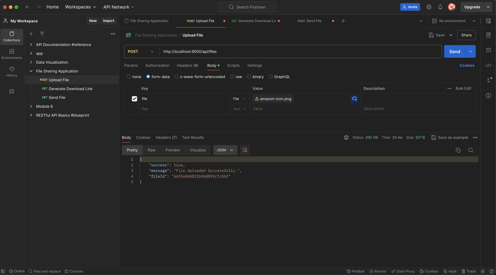
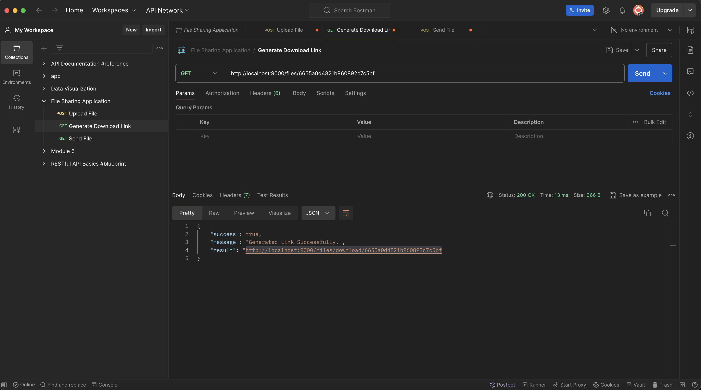
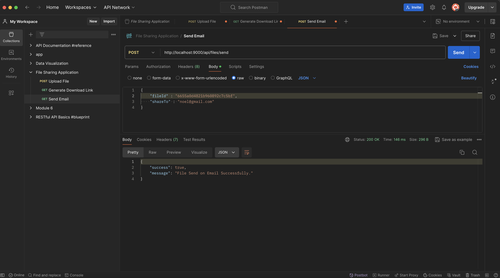
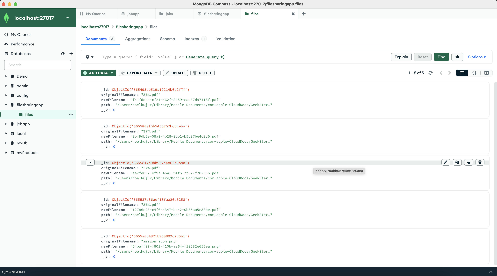

# File Sharing Application

This is a file sharing application built with Node.js, Express, and MongoDB. It allows users to upload files, generate unique download links, download files, and send files via email. The application uses Multer for file uploads and Nodemailer for sending emails.

## Screenshort

### Postman

1. Upload File



2. Generate Download Link



3. Send Email



### Mongodb Database



### Table of Contents

- Features
- Installation
- Configuration
- Usage
- API Endpoints
- File Structure
- Dependencies
- License

## Features

- Upload files to the server.
- Generate unique download links for the uploaded files.
- Download files using unique links.
- Send files to specified email addresses.

## Installation

1. Clone the repository:
```bash
git clone https://github.com/Lovenoelkujur/file-sharing-application.git
cd filesharingapp
```

2. Install the required dependencies:
```bash
npm install
```

3. Start MongoDB:
Make sure you have MongoDB installed and running on your local machine. The application connects to a MongoDB instance running at `mongodb://localhost:27017/filesharingapp`.

## Configuration

1. Nodemailer Configuration:

Update the `mailService.js` file in the `services` directory to configure the email settings. If you're using MailDev for development, no changes are needed. For production, update the SMTP server details accordingly.

## Usage

1. Start the server:
```bash
npm start
```
The server will start running on `http://localhost:9000`.

2. Upload a File:

Send a POST request to `/api/files/` with the file in the form-data.

3. Generate a Download Link:

Send a GET request to `/files/:uuid` with the file's UUID to get a download link.

4. Download a File:

Use the generated link from the previous step to download the file.

5. Send a File via Email:

Send a POST request to `/api/files/send` with the file's UUID and the recipient's email address.

## API Endpoints

1. `POST /api/files/:` Upload a file.

    - `Request`: Form-data with a file.
    - `Response`: JSON with success status and file ID.

    - Example Request:
    ```bash
    POST /api/files/
    Content-Type: multipart/form-data
    Body: file (form-data)
    ```
    - Example Response:
    ```json
    {
        "success": true,
        "message": "File Uploaded Successfully.",
        "fileId": "60d9c6c4e3b5a2b5b8d0b0c5"
    }
    ```

2. `GET /files/`
: Generate a download link for the file.

    - `Request`: UUID of the file.
    - `Response`: JSON with success status and download link.

    - Example Request:
    ```bash
    GET /files/60d9c6c4e3b5a2b5b8d0b0c5
    ```

    - Example Response:
    ```json
    {
        "success": true,
        "message": "Generated Link Successfully.",
        "result": "http://localhost:9000/files/download/60d9c6c4e3b5a2b5b8d0b0c5"
    }
    ```
3. `GET /files/download/`
: Download the file using the generated link.    

    - `Request`: UUID of the file.
    - `Response`: File download.

    - Example Request:
    ```bash
    GET /files/download/60d9c6c4e3b5a2b5b8d0b0c5
    ```

4. `POST /api/files/send`: Send a file via email.

    - `Request`: JSON with file ID and recipient's email.
    - `Response`: JSON with success status.

    - Example Request:
    ```json
    POST /api/files/send
    Content-Type: application/json
    Body: {
        "fileId": "60d9c6c4e3b5a2b5b8d0b0c5",
        "shareTo": "recipient@example.com"
    }
    ```
    - Example Response:
    ```json
    {
        "success": true,
        "message": "File Sent on Email Successfully."
    }
    ```

## File Structure

```bash
filesharingapp/
├── controllers/
│   └── file.js             # File controller with logic for handling requests
├── models/
│   └── file.js             # Mongoose schema and model for files
├── routes/
│   └── file.js             # API routes for file operations
├── services/
│   ├── mailService.js      # Service for sending emails using Nodemailer
│   └── uploadService.js    # Service for handling file uploads with Multer
├── files/                  # Directory where uploaded files are stored
├── .gitignore              # Git ignore file
├── app.js                  # Main application file
├── package.json            # Node.js package manifest
└── README.md               # This README file
```

## Dependencies

```json
{
    "express": "^4.19.2",
    "mongoose": "^8.4.0",
    "multer": "^1.4.5-lts.1",
    "nodemailer": "^6.9.13",
    "uuid": "^9.0.1"
}
```

- `Express`: Fast, unopinionated, minimalist web framework for Node.js.

- `Mongoose`: MongoDB object modeling tool designed to work in an asynchronous environment.

- `Multer`: Middleware for handling multipart/form-data, primarily used for uploading files.

- `Nodemailer`: Module for Node.js applications to allow easy email sending.

- `uuid`: Library for generating unique IDs.

## License

This project is licensed under the MIT License. See the LICENSE file for more details.
